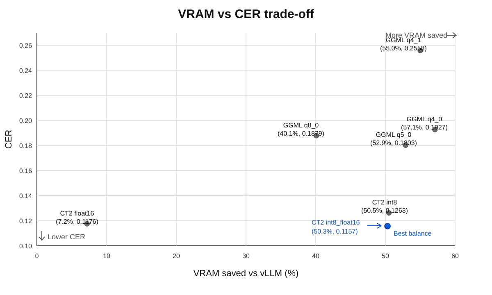

# 成功推論結果

本目錄的主要產出是每個模型版本各一份 `jsonl` 推論結果。正式比較請優先使用根目錄下的 `*.jsonl`。

來源教育部台語 leku 資料集前 100 筆最長的樣本推論結果

`相對 vLLM 省 VRAM` 以各版本觀測到的 VRAM 最大值保守估算，並以 vLLM HF `float16` 的 `4300 MiB` 作為基準。

| 版本 | 推論結果 | 成功/總數 | VRAM MiB | 相對 vLLM 省 VRAM |
|---|---|---:|---:|---:|
| vLLM HF `float16` | `vllm-hf-float16.jsonl` | 100/100 | 4300 | - |
| CT2 `float16` | `ct2-float16.jsonl` | 100/100 | 3991 | 7.2% |
| CT2 `int8_float16` | `ct2-int8_float16.jsonl` | 100/100 | 2135 | 50.3% |
| CT2 `int8` | `ct2-int8.jsonl` | 100/100 | 2129 | 50.5% |
| whisper.cpp / GGML `q4_0` | `whisper-cpp-ggml-q4_0.jsonl` | 100/100 | 1843 | 57.1% |
| whisper.cpp / GGML `q4_1` | `whisper-cpp-ggml-q4_1.jsonl` | 100/100 | 1935 | 55.0% |
| whisper.cpp / GGML `q5_0` | `whisper-cpp-ggml-q5_0.jsonl` | 100/100 | 2027 | 52.9% |
| whisper.cpp / GGML `q8_0` | `whisper-cpp-ggml-q8_0.jsonl` | 100/100 | 2575 | 40.1% |

## 相對 baseline 的 CER

以 `vllm-hf-float16.jsonl` 作為 baseline reference，先移除 transcript 內所有空白，再依字元級 Levenshtein distance 計算聚合 CER：

`CER = (S + D + I) / N`

其中 `S` 為 substitution、`D` 為 deletion、`I` 為 insertion、`N` 為 baseline reference 的總字元數。

| 比較版本 | CER | 相對上一列劣化 | 字元錯誤/參考字元 | 完全一致 |
|---|---:|---:|---:|---:|
| `ct2-int8_float16.jsonl` | 0.1157 | - | 633/5470 | 11 |
| `ct2-float16.jsonl` | 0.1176 | 1.6% | 643/5470 | 7 |
| `ct2-int8.jsonl` | 0.1263 | 7.4% | 691/5470 | 5 |
| `whisper-cpp-ggml-q5_0.jsonl` | 0.1803 | 42.8% | 986/5470 | 5 |
| `whisper-cpp-ggml-q8_0.jsonl` | 0.1879 | 4.2% | 1028/5470 | 6 |
| `whisper-cpp-ggml-q4_0.jsonl` | 0.1927 | 2.6% | 1054/5470 | 2 |
| `whisper-cpp-ggml-q4_1.jsonl` | 0.2558 | 32.7% | 1399/5470 | 2 |



若目標是「節省最多 VRAM，同時盡量少犧牲 CER」，目前 `CT2 int8_float16` 是最均衡的選擇：相對 vLLM 約省 50.3% VRAM，CER 也是所有比較版本中最低的 0.1157。`CT2 int8` 的 VRAM 幾乎相同，但 CER 比上一列劣化 7.4%；`q4_0` 雖然更省 VRAM，但 CER 已提高到 0.1927，取捨成本明顯變大。

## CT2 量化平台相容性

這次測試在 NVIDIA L4 上執行，其他 GPU 或 CPU 平台尚未詳細測試。依 CTranslate2 官方支援矩陣來看，`int8_float16` 在 Compute Capability 7.0 以上的 NVIDIA GPU 較適合；舊 GPU 可能會自動 fallback 成 `int8_float32` 或 `float32`，實際 VRAM 與速度不一定等同本次結果。

若要兼顧舊 GPU 或 CPU，`int8` 通常比 `int8_float16` 保守：CTranslate2 會依平台選擇可支援的 int8 組合；CPU 也可執行，x86-64 主要走 MKL 或 oneDNN，ARM64 則可走 Ruy。部署到不確定的平台時，可優先試 `compute_type="auto"` 或 `compute_type="int8"`；若要避開 FP16 相容性問題，可改用 `int8_float32`。

完整逐檔 worst samples 報表請看 `cer-baseline.md`。可用下面指令重新產生：

```bash
uv run stt-eval compare-results --baseline vllm-hf-float16.jsonl --results-dir results --output results/cer-baseline.md
```

## llama.cpp / GGML 觀察

JSONL 內可以看到各版本的第一筆樣本（`sample_index=1`）普遍比後續樣本慢，尤其是 whisper.cpp / GGML 系列特別明顯。這比較像啟動/暖機成本，不是單筆音檔本身的異常失敗。

另外，幾個量化版本也有輸出品質上的離群值：

- `q4_1` 有明顯短輸出，例如 `sample_index=25` 只有「（宏述）」、`sample_index=70` 只有「（農夫之家常言）」，長度跟其他樣本相比很突兀。
- `q4_0` 的 `sample_index=1` 混入英文碎片，例如「Rose through the…」，屬於明顯雜訊型輸出。
- `q8_0` 雖然沒有空輸出，但有多筆長尾慢樣本，例如 `sample_index=89`、`30`、`55`、`73`、`99`，都明顯慢於同版本中位數。

整體來說，CT2 和 vLLM 的結果比較穩，JSONL 沒看到明顯執行中斷；真正比較異常的是 whisper.cpp / GGML 的量化版本，尤其是 `q4_1` 的首筆超慢，以及少數疑似截斷或雜訊輸出。


## vLLM 記憶體用量

啟動 log 重點：

```text
Checkpoint size: 5.75 GiB
Model loading took 2.88 GiB memory
Estimated CUDA graph memory: 0.18 GiB total
Available KV cache memory: 16.9 GiB
GPU KV cache size: 19,881 tokens
Maximum concurrency for 448 tokens per request: 44.38x
```

目前 compose 使用 vLLM 預設 `--gpu-memory-utilization=0.92`，因此 vLLM 會盡量把 GPU 記憶體配置給 KV cache。這次觀測到的 `21267 MiB` 主要是預留高併發容量，不代表單一請求真的需要完整 21 GiB。

粗估單請求最低需求：

- 固定成本約 `20.8 GiB - 16.9 GiB = 3.9 GiB`。
- 單一 448 token request 的 KV cache 約 `16.9 GiB / 19881 * 448 = 0.38 GiB`。
- 理論低標約 `4.3 GiB`。
